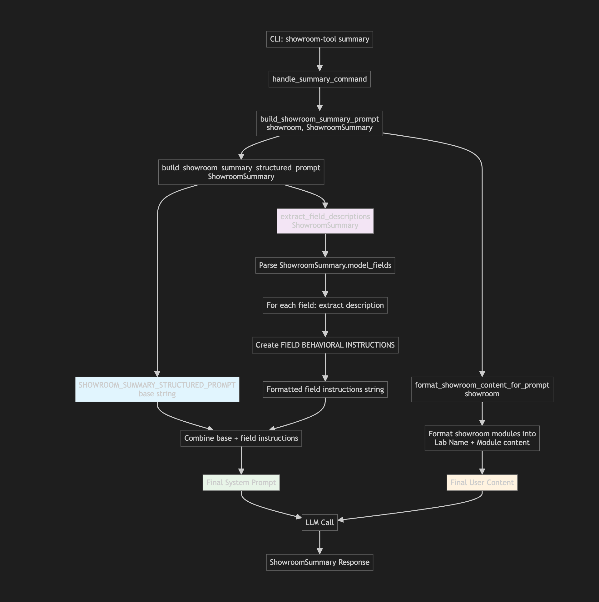

# Prompt Engineering Guide for Showroom Tool

This guide explains how the Showroom Tool's AI prompt system works and how developers and prompt engineers can modify it to achieve better results.

## Overview

The Showroom Tool uses a sophisticated prompt assembly system that combines base prompts with field-specific instructions extracted dynamically from Pydantic BaseModel descriptions. This creates highly structured and targeted prompts that guide the AI to produce accurate, consistent outputs.

## Prompt Assembly Flow

The prompt assembly process follows a multi-layered approach to build comprehensive system prompts:



## Key Components You Can Modify

### 1. Base Prompt Templates

Located in `src/showroom_tool/prompts.py`, these constants define the core AI persona and analysis focus:

- **`SHOWROOM_SUMMARY_BASE_SYSTEM_PROMPT`** - For lab summarization
- **`SHOWROOM_REVIEW_BASE_SYSTEM_PROMPT`** - For content review and scoring
- **`SHOWROOM_DESCRIPTION_BASE_SYSTEM_PROMPT`** - For catalog descriptions

**Example modification:**
```python
SHOWROOM_SUMMARY_BASE_SYSTEM_PROMPT = """You are an expert technical content analyst specializing in analyzing Red Hat hands-on laboratory exercises and demo content...

ANALYSIS FOCUS:
- Identify Red Hat products explicitly mentioned in the content
- Determine the target audience based on skill level and roles
- Extract clear learning objectives
- Create comprehensive summaries

CRITICAL INSTRUCTIONS:
- Be precise and accurate
- Focus only on clearly demonstrated content
"""
```

### 2. BaseModel Field Descriptions

The most powerful customization point is in the Pydantic BaseModel field descriptions in `src/config/basemodels.py`. These descriptions are automatically extracted and become field-specific AI instructions.

**Example from CatalogDescription:**
```python
headline: str = Field(
    ...,
    description="""
    CONCISE and CLEAR summary of the catalog item, in 1-2 sentences.
    First 115-120 characters are revealed on a thumbnail, so optimize for that.
    YOUR GOAL is to make the headline as INFORMATIVE and ACCURATE as possible.
    """
)
```

### 3. Behavioral Boundaries System

The `extract_field_descriptions()` function wraps each field description with behavioral boundaries to prevent instruction bleeding between fields:

```python
field_header = f"{field_name.upper()} FIELD BEHAVIORAL INSTRUCTIONS:"
behavioral_boundary = f"IGNORE everything except this field's specific focus. Your analytical approach for this field: {description}"
```

### 4. Context Hints (Optional)

You can provide additional context through the `context_hints` parameter in prompt building functions:

```python
context_hints = {
    "target_products": ["OpenShift", "RHEL", "Ansible"],
    "audience_focus": "Technical decision makers",
    "output_style": "Professional and concise"
}
```

## Role of BaseModel Description Fields

### Primary Purpose
BaseModel description fields serve as **direct AI instructions** that are dynamically injected into the system prompt. They are not just documentation—they actively guide AI behavior.

### Best Practices for Description Fields

1. **Be Specific and Directive**
   ```python
   # Good
   description="Extract EXACTLY 4-6 learning objectives. Focus on specific skills participants will gain."
   
   # Poor
   description="Learning objectives for the content"
   ```

2. **Use Action-Oriented Language**
   ```python
   # Good
   description="IDENTIFY specific Red Hat products explicitly mentioned. IGNORE implied products."
   
   # Poor
   description="Red Hat products in the lab"
   ```

3. **Include Constraints and Guidelines**
   ```python
   # Good
   description="""
   2 to 4 audiences who would benefit from this content.
   AVOID making up new audience types.
   USE these categories: System Admins, Cloud Admins, DevOps Engineers, Architects, Developers, Data Scientists.
   """
   ```

4. **Provide Examples When Helpful**
   ```python
   description="""
   Be specific about roles and use cases (e.g., "DevOps engineers new to containers").
   Focus on concrete skills and outcomes.
   """
   ```

### How Description Fields Become AI Instructions

1. **Field Scanning**: The system scans all fields in the BaseModel using `model.model_fields.items()`
2. **Description Extraction**: Extracts the `description` attribute from each field
3. **Instruction Generation**: Wraps each description in behavioral boundaries
4. **Prompt Integration**: Adds field instructions to the base prompt

**Generated field instruction example:**
```
HEADLINE FIELD BEHAVIORAL INSTRUCTIONS:
IGNORE everything except this field's specific focus. Your analytical approach for this field: CONCISE and CLEAR summary of the catalog item, in 1-2 sentences. First 115-120 characters are revealed on a thumbnail, so optimize for that. YOUR GOAL is to make the headline as INFORMATIVE and ACCURATE as possible.
```

## Advanced Customization

### Creating Custom Analysis Types

1. **Create a new BaseModel** in `src/config/basemodels.py`:
   ```python
   class MyCustomAnalysis(BaseModel):
       field1: str = Field(..., description="Detailed AI instructions for field1")
       field2: list[str] = Field(..., description="Specific guidance for field2")
   ```

2. **Add base prompt** in `src/showroom_tool/prompts.py`:
   ```python
   MY_CUSTOM_PROMPT = """You are an expert in custom analysis..."""
   ```

3. **Create prompt builder function**:
   ```python
   def build_custom_analysis_prompt(data, model_class):
       return build_enhanced_system_prompt(MY_CUSTOM_PROMPT, model_class)
   ```

### Modifying Existing Analysis Types

To modify behavior without changing code:

1. **Update BaseModel descriptions** - Immediate effect on AI behavior
2. **Adjust base prompts** - Changes overall analysis approach
3. **Add context hints** - Provides additional guidance for specific use cases

## Testing Your Prompt Changes

Use the `--output-prompt` flag to see the complete assembled prompt:

```bash
# View complete summary prompt
showroom-tool summary --output-prompt

# View complete review prompt  
showroom-tool review --output-prompt

# View complete description prompt
showroom-tool description --output-prompt
```

This shows you exactly what the AI receives, including:
- Base prompt template
- Field-specific behavioral instructions
- Context hints (if any)
- Total character count

## Debugging Prompt Issues

### Common Issues and Solutions

1. **Inconsistent AI outputs**
   - Check for conflicting instructions in field descriptions
   - Ensure behavioral boundaries are working (each field focuses on one thing)
   - Verify base prompt aligns with field requirements

2. **AI ignoring specific field requirements**
   - Make field descriptions more directive and specific
   - Add constraints and examples
   - Use stronger language (MUST, ALWAYS, NEVER)

3. **Field instruction bleeding**
   - The behavioral boundaries system should prevent this
   - If it occurs, make field descriptions more focused
   - Avoid generic language that could apply to multiple fields

### Analysis Tools

- **Prompt Length**: Check character counts in `--output-prompt` output
- **Field Coverage**: Ensure all important fields have descriptive instructions
- **Instruction Clarity**: Test with simple examples to verify AI understanding

## Performance Considerations

- **Prompt Length**: Longer prompts cost more tokens but provide better guidance
- **Field Descriptions**: More detailed descriptions improve accuracy but increase prompt size
- **Context Hints**: Use sparingly for specific customizations rather than general guidance

## Best Practices Summary

1. **Start with clear BaseModel descriptions** - This is your primary control mechanism
2. **Test with `--output-prompt`** - Always verify what the AI actually receives
3. **Be specific and directive** - Vague descriptions produce inconsistent results
4. **Use behavioral boundaries** - One focus per field prevents instruction conflicts
5. **Iterate and refine** - Test outputs and adjust descriptions based on results
6. **Document your changes** - Keep track of what modifications achieve desired results

The prompt engineering system in Showroom Tool is designed to be both powerful and maintainable. By understanding these components, you can achieve precise control over AI behavior while maintaining clean, readable code.